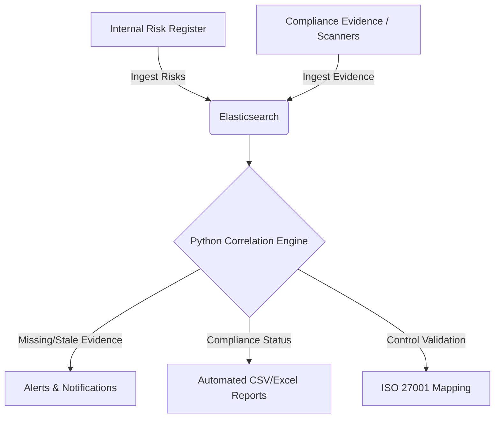

# Security GRC Labs: Automated Compliance & Risk Monitoring 🛡️

A comprehensive Security Governance, Risk, and Compliance (GRC) lab environment demonstrating automated risk correlation, evidence tracking, and alerting using **Elasticsearch** and **Python**.

This project models how a modern GRC platform ingests technical and administrative evidence, correlates it against a risk register, and automatically triggers alerts when critical risks fall out of compliance.

---

## 🏛️ Architecture & Data Flow



---

## ✨ Features

- **Automated Risk Ingestion:** Pull programmatic risks from internal sources and ingest them into a centralized Elasticsearch index.
- **Evidence Tracking:** Automatically match compliance evidence (like MFA status, asset encryption) to specific risks and framework controls.
- **Continuous Correlation & Alerting:** Detect high-risk items lacking valid evidence and trigger immediate notifications/logs.
- **Automated Reporting:** Generate timestamped CSV and Excel compliance reports on demand.
- **Framework Control Validation:** Map technical findings directly to standards like ISO 27001 (A.8 Asset Management, A.9 Access Control, A.12 Operations Security).

---

## 🎯 Who This Project Is For

* **Security Engineers** looking to automate compliance validation rather than relying on manual audits.
* **GRC Analysts** interested in leveraging Elasticsearch for continuous monitoring and reporting.
* **Security Practitioners** building portfolio projects to showcase technical implementation of continuous compliance and risk management.

---

## 📁 Project Structure

```text
security-grc-labs/
├── automation-scripts/
│   ├── ingest-risk.py               # Connects to ES and populates the risk register index
│   ├── ingest_evidence.py           # Uploads automated compliance evidence logs
│   ├── correlate_risks_evidence.py  # Maps ingested risks to their supporting evidence
│   ├── detect_high_risks.py         # Flags risks based on impact/likelihood thresholds
│   ├── notify_high_risks.py         # Logs alerts for high-risk findings
│   ├── alerts_notifications.py      # Checks for high impact risks missing evidence
│   ├── automated_reporting.py       # Outputs merged compliance posture to CSV/XLSX
│   └── iso27001_check.py            # Validates mock technical data against ISO 27001
├── .env.example                     # Template for environment variables (credentials)
├── requirements.txt                 # Python dependencies
└── README.md                        # Project documentation
```

---

## 🚀 Getting Started

### Prerequisites

- **Python 3.9+**
- **Elasticsearch 8.x** instance (local, Docker, or Elastic Cloud)
- **Git**

### 1. Clone & Setup

```bash
git clone https://github.com/yourusername/security-grc-labs.git
cd security-grc-labs

# Create and activate a virtual environment (optional but recommended)
python -m venv venv
source venv/bin/activate  # On Windows use: venv\Scripts\activate

# Install dependencies
pip install -r requirements.txt
```

### 2. Configure Environment

Copy the example environment file and configure your Elasticsearch credentials. This ensures your API keys and passwords are not accidentally committed to source control.

```bash
cp .env.example .env
```

Edit the `.env` file with your specific cluster details:
```ini
ES_HOST=https://localhost:9200
ES_API_KEY=your_api_key_here
ES_USER=elastic
ES_PASSWORD=your_password_here
```

### 3. Running the Pipeline

For a full end-to-end simulation of the GRC workflow, execute the scripts in the following order:

```bash
cd automation-scripts

# 1. Ingest Data
python ingest-risk.py                  # Load risk register data into ES
python ingest_evidence.py              # Load sample automated evidence into ES

# 2. Correlate & Detect
python correlate_risks_evidence.py     # Map risks vs evidence
python detect_high_risks.py            # Flag high-risk items based on likelihood/impact

# 3. Alert & Report
python alerts_notifications.py         # Trigger alerts for critical risks missing evidence
python notify_high_risks.py            # Generate a local log file of all high-risk items
python automated_reporting.py          # Generate spreadsheet reports (CSV/XLSX)

# 4. Control Validation
python iso27001_check.py               # Run the automated ISO 27001 control mapper
```

---

## 📊 Dashboards & Visualization

By connecting Kibana to your Elasticsearch indices (`grc-risk-register` and `grc-evidence`), you can build continuous compliance dashboards.

*(Placeholder: Add your Kibana Dashboard Screenshots here)*
- **Risk Overview:** Shows risk distribution by category, owner, and impact.
- **Compliance Gaps:** Highlights critical risks lacking sufficient evidence over time.

---

## ⚠️ Security Notice

This repository uses `python-dotenv` for managing credentials. **Never commit your `.env` file to version control.** If you are using this as a template, be sure to keep your Elasticsearch credentials secure and rotate them if accidentally exposed.
